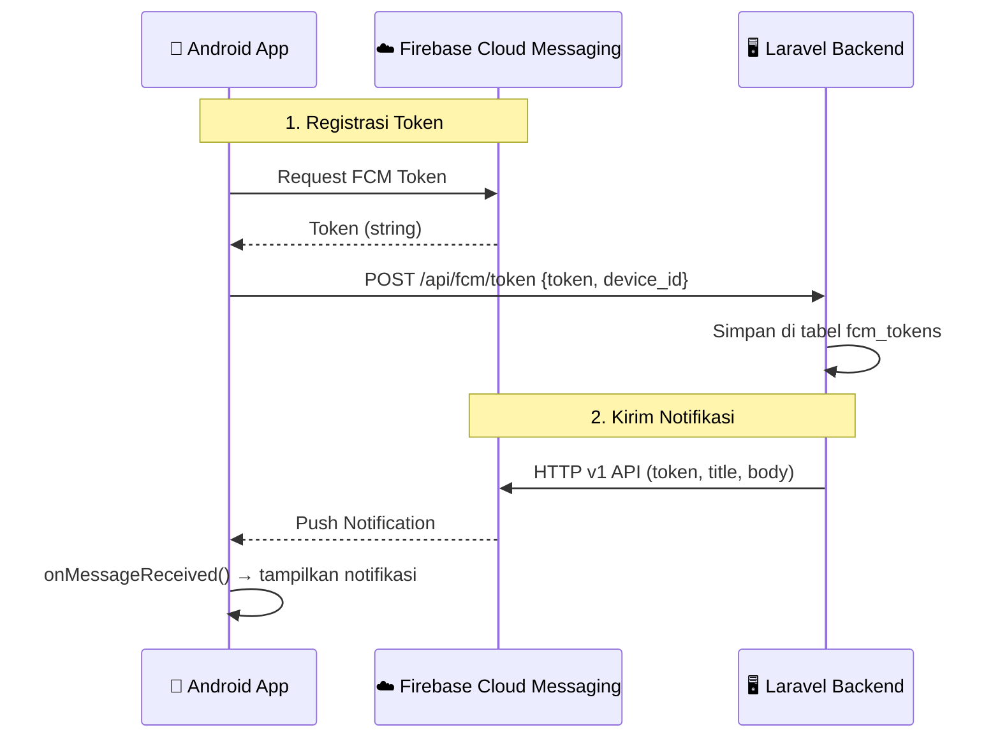

# 🔔 Panduan Integrasi FCM — smaRT (Android + Laravel)

## Status Saat Ini

Berikut status konfigurasi FCM di project kamu:

| Komponen | Status | Keterangan |
|---|---|---|
| `google-services.json` | ✅ Ada | Sudah ada di `app/` |
| `google-services` plugin | ✅ Ada | Di `build.gradle.kts` |
| `firebase-messaging` dependency | ✅ Ada | Di `build.gradle.kts` |
| `MyFirebaseMessagingService` | ⚠️ Parsial | Ada, tapi `onNewToken` belum kirim ke backend |
| `AndroidManifest.xml` service | ✅ Ada | Service & meta-data sudah terdaftar |
| `POST_NOTIFICATIONS` permission | ✅ Ada | Di manifest & runtime permission request |
| API endpoint `/api/fcm/token` | ❌ Belum ada | Perlu dibuat di backend Laravel |
| Tabel `fcm_tokens` di database | ❌ Belum ada | Perlu migration baru |
| Backend mengirim FCM push | ❌ Belum ada | Perlu Firebase Admin SDK di Laravel |

---

## Arsitektur Alur FCM



---

## Bagian 1: Perubahan di Android (Kotlin)

### 1.1 Tambah Endpoint API Baru

#### [ApiService.kt](file:///c:/Users/Abhinaya/AndroidStudioProjects/smaRT/app/src/main/java/com/capstone/smart/data/remote/ApiService.kt)

Tambahkan endpoint untuk mengirim FCM token ke backend:

```diff
 interface ApiService {

+    // ══════════════════════════════════════════════
+    // FCM TOKEN
+    // ══════════════════════════════════════════════
+
+    @POST("fcm/token")
+    suspend fun sendFcmToken(
+        @Body request: FcmTokenRequest
+    ): Response<MessageResponse>
+
+    @DELETE("fcm/token")
+    suspend fun deleteFcmToken(
+        @Body request: FcmTokenRequest
+    ): Response<MessageResponse>
+
     // ══════════════════════════════════════════════
     // AUTH
     // ══════════════════════════════════════════════
```

### 1.2 Tambah Data Model FCM

#### [AuthModels.kt](file:///c:/Users/Abhinaya/AndroidStudioProjects/smaRT/app/src/main/java/com/capstone/smart/data/model/AuthModels.kt)

Tambahkan di akhir file:

```diff
+// ══════════════════════════════════════════════
+// FCM TOKEN
+// ══════════════════════════════════════════════
+
+data class FcmTokenRequest(
+    val token: String,
+    @SerializedName("device_id")
+    val deviceId: String
+)
```

### 1.3 Tambah Fungsi Repository

#### [SmaRTRepository.kt](file:///c:/Users/Abhinaya/AndroidStudioProjects/smaRT/app/src/main/java/com/capstone/smart/data/repository/SmaRTRepository.kt)

```diff
+    // ═══════════ FCM TOKEN ═══════════
+
+    suspend fun sendFcmToken(token: String, deviceId: String): Result<String> {
+        return try {
+            val response = api.sendFcmToken(FcmTokenRequest(token, deviceId))
+            if (response.isSuccessful) {
+                Result.success(response.body()?.message ?: "Token tersimpan.")
+            } else {
+                Result.failure(Exception("Gagal menyimpan FCM token."))
+            }
+        } catch (e: Exception) {
+            Result.failure(Exception("Tidak bisa terhubung ke server."))
+        }
+    }
+
+    suspend fun deleteFcmToken(token: String, deviceId: String): Result<String> {
+        return try {
+            val response = api.deleteFcmToken(FcmTokenRequest(token, deviceId))
+            if (response.isSuccessful) {
+                Result.success(response.body()?.message ?: "Token dihapus.")
+            } else {
+                Result.failure(Exception("Gagal menghapus FCM token."))
+            }
+        } catch (e: Exception) {
+            Result.failure(Exception("Tidak bisa terhubung ke server."))
+        }
+    }
```

### 1.4 Update `MyFirebaseMessagingService`

#### [MyFirebaseMessagingService.kt](file:///c:/Users/Abhinaya/AndroidStudioProjects/smaRT/app/src/main/java/com/capstone/smart/MyFirebaseMessagingService.kt) — **Versi Lengkap**

Ini adalah kode lengkap yang menggantikan file yang ada. Perubahan utama:
- `onNewToken()` sekarang mengirim token ke backend Laravel
- Menggunakan `device_id` unik berbasis `Settings.Secure.ANDROID_ID`
- Token disimpan di `SharedPreferences` agar bisa dikirim ulang saat login

```kotlin
package com.capstone.smart.service

import android.app.NotificationChannel
import android.app.NotificationManager
import android.app.PendingIntent
import android.content.Context
import android.content.Intent
import android.os.Build
import android.provider.Settings
import android.util.Log
import androidx.core.app.NotificationCompat
import com.capstone.smart.MainActivity
import com.capstone.smart.R
import com.capstone.smart.data.model.FcmTokenRequest
import com.capstone.smart.data.remote.ApiClient
import com.google.firebase.messaging.FirebaseMessagingService
import com.google.firebase.messaging.RemoteMessage
import kotlinx.coroutines.CoroutineScope
import kotlinx.coroutines.Dispatchers
import kotlinx.coroutines.launch

class MyFirebaseMessagingService : FirebaseMessagingService() {

    companion object {
        private const val TAG = "FCMService"
        private const val PREFS_NAME = "fcm_prefs"
        private const val KEY_FCM_TOKEN = "fcm_token"

        /**
         * Simpan FCM token di SharedPreferences.
         * Dipanggil agar token bisa dikirim ulang ke backend saat login.
         */
        fun getSavedToken(context: Context): String? {
            return context.getSharedPreferences(PREFS_NAME, Context.MODE_PRIVATE)
                .getString(KEY_FCM_TOKEN, null)
        }

        fun getDeviceId(context: Context): String {
            return Settings.Secure.getString(
                context.contentResolver,
                Settings.Secure.ANDROID_ID
            )
        }
    }

    override fun onNewToken(token: String) {
        super.onNewToken(token)
        Log.d(TAG, "FCM Token baru: $token")

        // Simpan ke SharedPreferences
        getSharedPreferences(PREFS_NAME, Context.MODE_PRIVATE)
            .edit()
            .putString(KEY_FCM_TOKEN, token)
            .apply()

        // Kirim ke backend (hanya jika sudah login / ada auth token)
        sendTokenToBackend(token)
    }

    private fun sendTokenToBackend(token: String) {
        // Cek apakah user sudah login (ada auth token)
        val authToken = ApiClient.authToken ?: return

        val deviceId = getDeviceId(this)
        CoroutineScope(Dispatchers.IO).launch {
            try {
                val response = ApiClient.instance.sendFcmToken(
                    FcmTokenRequest(token, deviceId)
                )
                if (response.isSuccessful) {
                    Log.d(TAG, "FCM token berhasil dikirim ke backend")
                } else {
                    Log.e(TAG, "Gagal kirim FCM token: ${response.code()}")
                }
            } catch (e: Exception) {
                Log.e(TAG, "Error kirim FCM token", e)
            }
        }
    }

    override fun onMessageReceived(remoteMessage: RemoteMessage) {
        super.onMessageReceived(remoteMessage)
        Log.d(TAG, "Pesan diterima dari: ${remoteMessage.from}")

        // Cek apakah pesan berisi data payload.
        if (remoteMessage.data.isNotEmpty()) {
            val title = remoteMessage.data["title"] ?: "Notifikasi Baru"
            val body = remoteMessage.data["body"] ?: "Anda memiliki pesan baru."
            val type = remoteMessage.data["type"] // e.g. "broadcast", "surat", "panic"
            sendNotification(title, body, type)
        }

        // Cek apakah pesan berisi notification payload (FCM default).
        remoteMessage.notification?.let {
            sendNotification(it.title ?: "smaRT", it.body ?: "")
        }
    }

    private fun sendNotification(title: String, messageBody: String, type: String? = null) {
        val intent = Intent(this, MainActivity::class.java).apply {
            addFlags(Intent.FLAG_ACTIVITY_CLEAR_TOP)
            // Tambahkan data type agar app bisa navigate ke screen yang benar
            type?.let { putExtra("notification_type", it) }
        }
        val pendingIntent = PendingIntent.getActivity(
            this, 0, intent,
            PendingIntent.FLAG_IMMUTABLE or PendingIntent.FLAG_ONE_SHOT
        )

        val channelId = "smart_fcm_channel"
        val notificationBuilder = NotificationCompat.Builder(this, channelId)
            .setSmallIcon(R.mipmap.ic_launcher)
            .setContentTitle(title)
            .setContentText(messageBody)
            .setAutoCancel(true)
            .setPriority(NotificationCompat.PRIORITY_HIGH)
            .setContentIntent(pendingIntent)

        val notificationManager = getSystemService(Context.NOTIFICATION_SERVICE) as NotificationManager

        // Sejak Android Oreo (API 26), notifikasi memerlukan NotificationChannel
        if (Build.VERSION.SDK_INT >= Build.VERSION_CODES.O) {
            val channel = NotificationChannel(
                channelId,
                "Notifikasi smaRT",
                NotificationManager.IMPORTANCE_HIGH
            ).apply {
                description = "Notifikasi dari aplikasi smaRT"
            }
            notificationManager.createNotificationChannel(channel)
        }

        // Gunakan unique ID agar notifikasi tidak timpa satu sama lain
        val notificationId = System.currentTimeMillis().toInt()
        notificationManager.notify(notificationId, notificationBuilder.build())
    }
}
```

### 1.5 Kirim Token Saat Login Berhasil

Setelah login berhasil, token FCM yang tersimpan perlu dikirim ke backend. Tambahkan ini di [SmaRTRepository.kt](file:///c:/Users/Abhinaya/AndroidStudioProjects/smaRT/app/src/main/java/com/capstone/smart/data/repository/SmaRTRepository.kt) di fungsi `login()`:

```diff
 suspend fun login(nik: String, password: String): Result<LoginResponse> {
     return try {
         val response = api.login(LoginRequest(nik, password))
         if (response.isSuccessful && response.body() != null) {
             val body = response.body()!!
             ApiClient.authToken = body.token
+
+            // Kirim FCM token ke backend setelah login
+            // (dilakukan di background, tidak blocking login flow)
+            // Panggil ini dari ViewModel/Activity yang punya Context
+
             Result.success(body)
         } else {
             Result.failure(Exception("NIK atau password salah."))
         }
     } catch (e: Exception) {
         Result.failure(Exception("Tidak bisa terhubung ke server."))
     }
 }
```

Lalu di ViewModel atau di `LoginScreen` composable, setelah login berhasil:

```kotlin
// Di dalam onLoginSuccess callback atau ViewModel
LaunchedEffect(loginSuccess) {
    if (loginSuccess) {
        // Kirim FCM token ke backend
        val fcmToken = MyFirebaseMessagingService.getSavedToken(context)
        val deviceId = MyFirebaseMessagingService.getDeviceId(context)
        if (fcmToken != null) {
            viewModel.sendFcmToken(fcmToken, deviceId)
        }
    }
}
```

### 1.6 Hapus Token Saat Logout

Di [SmaRTRepository.kt](file:///c:/Users/Abhinaya/AndroidStudioProjects/smaRT/app/src/main/java/com/capstone/smart/data/repository/SmaRTRepository.kt), update fungsi `logout()`:

```diff
 suspend fun logout(): Result<String> {
     return try {
+        // Hapus FCM token dari backend sebelum logout
+        // (agar user tidak menerima notifikasi setelah logout)
         val response = api.logout()
         ApiClient.authToken = null
         if (response.isSuccessful) {
             Result.success(response.body()?.message ?: "Berhasil logout.")
         } else {
             Result.failure(Exception("Gagal logout."))
         }
     } catch (e: Exception) {
         Result.failure(Exception("Tidak bisa terhubung ke server."))
     }
 }
```

---

## Bagian 2: Perubahan di Backend Laravel

### 2.1 Install Firebase Admin SDK

```bash
composer require kreait/laravel-firebase
```

### 2.2 Konfigurasi Firebase Credentials

1. Buka [Firebase Console](https://console.firebase.google.com/) → Project Settings → Service Accounts
2. Klik **"Generate New Private Key"** → Download file JSON
3. Simpan file sebagai `storage/firebase-credentials.json`
4. Tambahkan di `.env`:

```env
FIREBASE_CREDENTIALS=storage/firebase-credentials.json
```

5. Publish config (opsional):

```bash
php artisan vendor:publish --provider="Kreait\Laravel\Firebase\ServiceProvider" --tag=config
```

### 2.3 Migration — Tabel `fcm_tokens`

```bash
php artisan make:migration create_fcm_tokens_table
```

```php
<?php

use Illuminate\Database\Migrations\Migration;
use Illuminate\Database\Schema\Blueprint;
use Illuminate\Support\Facades\Schema;

return new class extends Migration
{
    public function up(): void
    {
        Schema::create('fcm_tokens', function (Blueprint $table) {
            $table->uuid('id')->primary();
            $table->uuid('user_id');
            $table->string('token', 512);
            $table->string('device_id', 255);
            $table->timestamps();

            $table->foreign('user_id')
                  ->references('id')
                  ->on('users')
                  ->onDelete('cascade');

            // Satu perangkat, satu token per user
            $table->unique(['user_id', 'device_id']);
        });
    }

    public function down(): void
    {
        Schema::dropIfExists('fcm_tokens');
    }
};
```

```bash
php artisan migrate
```

### 2.4 Model — `FcmToken`

```bash
php artisan make:model FcmToken
```

```php
<?php
// app/Models/FcmToken.php

namespace App\Models;

use Illuminate\Database\Eloquent\Concerns\HasUuids;
use Illuminate\Database\Eloquent\Model;

class FcmToken extends Model
{
    use HasUuids;

    protected $fillable = ['user_id', 'token', 'device_id'];

    public function user()
    {
        return $this->belongsTo(User::class);
    }
}
```

Tambahkan relasi di model `User`:

```php
// Di app/Models/User.php, tambahkan:
public function fcmTokens()
{
    return $this->hasMany(FcmToken::class);
}
```

### 2.5 Controller — `FcmTokenController`

```bash
php artisan make:controller FcmTokenController
```

```php
<?php
// app/Http/Controllers/FcmTokenController.php

namespace App\Http\Controllers;

use App\Models\FcmToken;
use Illuminate\Http\Request;
use Illuminate\Support\Facades\Auth;

class FcmTokenController extends Controller
{
    /**
     * Simpan atau update FCM token perangkat.
     * POST /api/fcm/token
     */
    public function store(Request $request)
    {
        $request->validate([
            'token'     => 'required|string|max:512',
            'device_id' => 'required|string|max:255',
        ]);

        FcmToken::updateOrCreate(
            [
                'user_id'   => Auth::id(),
                'device_id' => $request->device_id,
            ],
            [
                'token' => $request->token,
            ]
        );

        return response()->json([
            'message' => 'FCM token berhasil disimpan.'
        ]);
    }

    /**
     * Hapus FCM token perangkat (saat logout).
     * DELETE /api/fcm/token
     */
    public function destroy(Request $request)
    {
        $request->validate([
            'device_id' => 'required|string|max:255',
        ]);

        FcmToken::where('user_id', Auth::id())
            ->where('device_id', $request->device_id)
            ->delete();

        return response()->json([
            'message' => 'FCM token berhasil dihapus.'
        ]);
    }
}
```

### 2.6 Routes

Tambahkan di `routes/api.php`:

```php
// FCM Token
Route::middleware('auth:api')->group(function () {
    Route::post('fcm/token', [FcmTokenController::class, 'store']);
    Route::delete('fcm/token', [FcmTokenController::class, 'destroy']);
});
```

### 2.7 Service — `FcmNotificationService` (Helper untuk Kirim Push)

```bash
php artisan make:class Services/FcmNotificationService
```

Atau buat file manual di `app/Services/FcmNotificationService.php`:

```php
<?php
// app/Services/FcmNotificationService.php

namespace App\Services;

use App\Models\FcmToken;
use Kreait\Firebase\Contract\Messaging;
use Kreait\Firebase\Messaging\CloudMessage;
use Kreait\Firebase\Messaging\Notification;
use Illuminate\Support\Facades\Log;

class FcmNotificationService
{
    protected Messaging $messaging;

    public function __construct(Messaging $messaging)
    {
        $this->messaging = $messaging;
    }

    /**
     * Kirim notifikasi ke satu user.
     */
    public function sendToUser(string $userId, string $title, string $body, array $data = []): void
    {
        $tokens = FcmToken::where('user_id', $userId)->pluck('token')->toArray();

        if (empty($tokens)) {
            Log::info("FCM: User {$userId} tidak punya token terdaftar.");
            return;
        }

        $this->sendToTokens($tokens, $title, $body, $data);
    }

    /**
     * Kirim notifikasi ke banyak user sekaligus.
     */
    public function sendToUsers(array $userIds, string $title, string $body, array $data = []): void
    {
        $tokens = FcmToken::whereIn('user_id', $userIds)->pluck('token')->toArray();

        if (empty($tokens)) {
            return;
        }

        $this->sendToTokens($tokens, $title, $body, $data);
    }

    /**
     * Kirim notifikasi ke semua user di RT tertentu.
     */
    public function sendToRT(string $rtId, string $title, string $body, array $data = []): void
    {
        $tokens = FcmToken::whereHas('user', function ($query) use ($rtId) {
            $query->where('id_rt', $rtId);
        })->pluck('token')->toArray();

        if (empty($tokens)) {
            return;
        }

        $this->sendToTokens($tokens, $title, $body, $data);
    }

    /**
     * Kirim ke list token FCM.
     */
    private function sendToTokens(array $tokens, string $title, string $body, array $data = []): void
    {
        $notification = Notification::create($title, $body);

        // Tambahkan title dan body ke data payload juga
        // agar bisa ditangkap oleh onMessageReceived() di Android
        $data = array_merge($data, [
            'title' => $title,
            'body'  => $body,
        ]);

        $message = CloudMessage::new()
            ->withNotification($notification)
            ->withData($data);

        try {
            $report = $this->messaging->sendMulticast($message, $tokens);

            Log::info("FCM: {$report->successes()->count()} sukses, {$report->failures()->count()} gagal");

            // Hapus token yang sudah tidak valid
            foreach ($report->failures()->getItems() as $failure) {
                $invalidToken = $failure->target()->value();
                FcmToken::where('token', $invalidToken)->delete();
                Log::warning("FCM: Token tidak valid dihapus: {$invalidToken}");
            }
        } catch (\Exception $e) {
            Log::error("FCM Error: " . $e->getMessage());
        }
    }
}
```

---

## Bagian 3: Contoh Penggunaan di Backend

### 3.1 Kirim Notifikasi Saat Broadcast Dibuat

Di `BroadcastController@store`:

```php
use App\Services\FcmNotificationService;

public function store(Request $request, FcmNotificationService $fcm)
{
    // ... validasi & simpan broadcast ...

    $broadcast = Broadcast::create([...]);

    // Kirim push notification ke semua warga di RT
    $rtId = Auth::user()->id_rt;
    $fcm->sendToRT($rtId, $broadcast->judul, $broadcast->isi_pesan, [
        'type' => 'broadcast',
        'broadcast_id' => $broadcast->id,
    ]);

    return response()->json([
        'message' => 'Broadcast berhasil dikirim.',
        'data' => $broadcast
    ], 201);
}
```

### 3.2 Kirim Notifikasi Saat Panic Trigger

Di `PanicController@trigger`:

```php
public function trigger(Request $request, FcmNotificationService $fcm)
{
    // ... validasi & simpan panic log ...

    $panic = PanicLog::create([...]);
    $user = Auth::user();

    // Kirim ke semua PENGURUS & KETUA di RT
    $pengurusIds = User::where('id_rt', $user->id_rt)
        ->whereIn('role', ['PENGURUS', 'KETUA'])
        ->pluck('id')
        ->toArray();

    $fcm->sendToUsers($pengurusIds, '🚨 DARURAT!', "{$user->nama} membutuhkan bantuan!", [
        'type'      => 'panic',
        'panic_id'  => $panic->id,
        'latitude'  => $panic->latitude,
        'longitude' => $panic->longitude,
    ]);

    return response()->json([...], 200);
}
```

### 3.3 Kirim Notifikasi Saat Status Surat Berubah

```php
public function review(Request $request, FcmNotificationService $fcm)
{
    // ... update surat status ...

    $surat = PengajuanSurat::find($request->id);
    $surat->update(['status' => $request->status]);

    $statusText = $request->status === 'APPROVED' ? 'disetujui ✅' : 'ditolak ❌';

    $fcm->sendToUser($surat->user_id, 'Update Surat', "Surat \"{$surat->nama_surat}\" telah {$statusText}.", [
        'type'     => 'surat',
        'surat_id' => $surat->id,
        'status'   => $request->status,
    ]);

    return response()->json([...], 200);
}
```

---

## Bagian 4: Checklist Implementasi

### Android
- [ ] Tambahkan `FcmTokenRequest` di [AuthModels.kt](file:///c:/Users/Abhinaya/AndroidStudioProjects/smaRT/app/src/main/java/com/capstone/smart/data/model/AuthModels.kt)
- [ ] Tambahkan endpoint `sendFcmToken` & `deleteFcmToken` di [ApiService.kt](file:///c:/Users/Abhinaya/AndroidStudioProjects/smaRT/app/src/main/java/com/capstone/smart/data/remote/ApiService.kt)
- [ ] Tambahkan fungsi `sendFcmToken` & `deleteFcmToken` di [SmaRTRepository.kt](file:///c:/Users/Abhinaya/AndroidStudioProjects/smaRT/app/src/main/java/com/capstone/smart/data/repository/SmaRTRepository.kt)
- [ ] Update [MyFirebaseMessagingService.kt](file:///c:/Users/Abhinaya/AndroidStudioProjects/smaRT/app/src/main/java/com/capstone/smart/MyFirebaseMessagingService.kt) — kirim token ke backend
- [ ] Kirim FCM token setelah login berhasil (di ViewModel/Composable)
- [ ] Hapus FCM token sebelum logout

### Laravel Backend
- [ ] `composer require kreait/laravel-firebase`
- [ ] Download `firebase-credentials.json` dari Firebase Console
- [ ] Tambahkan `FIREBASE_CREDENTIALS` di `.env`
- [ ] Buat migration `fcm_tokens`
- [ ] Buat model `FcmToken`
- [ ] Tambahkan relasi `fcmTokens()` di model `User`
- [ ] Buat `FcmTokenController`
- [ ] Tambahkan routes di `api.php`
- [ ] Buat `FcmNotificationService`
- [ ] Integrasikan push di controller: Broadcast, Panic, Surat

---

## Bagian 5: Tips & Best Practices

> [!TIP]
> **Token Refresh**: FCM token bisa berubah kapan saja (reinstall app, clear data, dsb). Pastikan `onNewToken()` selalu mengirim token terbaru ke backend.

> [!IMPORTANT]
> **Firebase Credentials**: File `firebase-credentials.json` berisi private key. **JANGAN** commit ke Git! Tambahkan ke `.gitignore`.

> [!WARNING]
> **Rate Limiting FCM**: Google membatasi pengiriman pesan. Untuk broadcast ke banyak user, gunakan `sendMulticast()` (max 500 token per batch). Jika lebih dari 500, loop per batch.

> [!NOTE]
> **Data vs Notification Payload**: Kode di atas mengirim keduanya. Data payload selalu sampai ke `onMessageReceived()`, sementara notification payload ditangani oleh system tray jika app di background. Untuk kontrol penuh, kirim hanya data payload dari backend.
